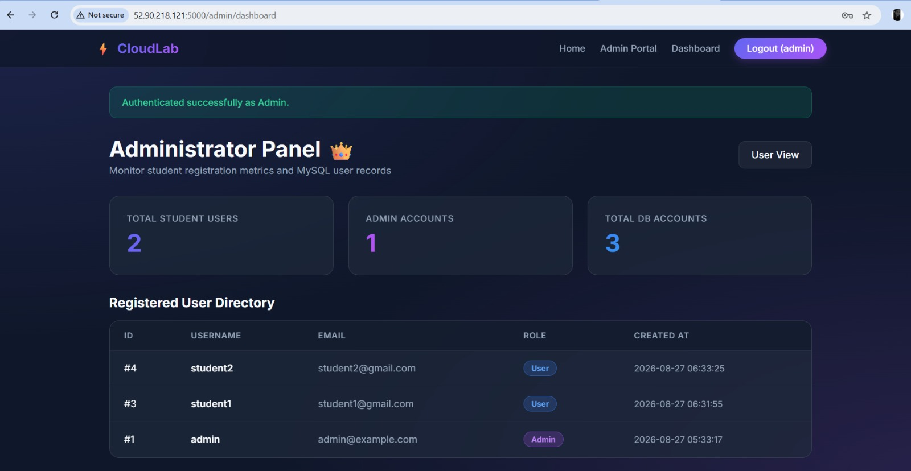

# Flask MySQL Web Application

## 📌 Project Overview

This project is a web application developed using **Python Flask** and **MySQL**. It provides a simple user registration system where users can enter their details through a web interface, and the information is stored in a MySQL database.

The application is deployed on an **AWS EC2 Linux server** and can be accessed through a web browser.

## 🚀 Features

* User Registration
* MySQL Database Integration
* Flask-based Backend
* HTML and CSS Frontend
* Database connectivity using environment variables
* Linux server deployment
* AWS EC2 deployment
* Nginx configuration
* Git and GitHub integration

## 🛠️ Technologies Used

| Technology | Purpose                    |
| ---------- | -------------------------- |
| Python     | Backend programming        |
| Flask      | Web framework              |
| MySQL      | Database                   |
| HTML       | Web page structure         |
| CSS        | Web page styling           |
| Linux      | Server operating system    |
| AWS EC2    | Cloud server               |
| Nginx      | Web server / Reverse Proxy |
| Git        | Version control            |
| GitHub     | Source code management     |

## 📂 Project Structure

```text
flask_with_mysql/
│
├── app.py
├── requirements.txt
├── templates/
│   ├── index.html
│   └── register.html
│
├── static/
│   └── css/
│
├── .gitignore
└── README.md
```

## 💻 Prerequisites

Before running the project, make sure the following are installed:

* Python 3
* pip
* MySQL
* Git

## ⚙️ Installation

### 1. Clone the Repository

```bash
git clone YOUR_GITHUB_REPOSITORY_URL
cd flask_with_mysql
```

### 2. Create a Virtual Environment

```bash
python3 -m venv temenv
```

### 3. Activate the Virtual Environment

Linux:

```bash
source temenv/bin/activate
```

Windows:

```bash
temenv\Scripts\activate
```

### 4. Install Dependencies

```bash
pip install -r requirements.txt
```

## 🗄️ Database Configuration

Create a MySQL database for the application.

Example:

```sql
CREATE DATABASE flask_database;
```

Then configure the database connection using environment variables.

Create a `.env` file:

```env
DB_HOST=localhost
DB_USER=your_username
DB_PASSWORD=your_password
DB_NAME=flask_database
```

Replace the values with your actual MySQL credentials.

### 🔐 Security Note

Do not upload `.env` to GitHub because it may contain sensitive database credentials.

Add the following to `.gitignore`:

```text
.env
temenv/
__pycache__/
*.pyc
```

## ▶️ Running the Application

Activate the virtual environment:

```bash
source temenv/bin/activate
```

Run the Flask application:

```bash
python3 app.py
```

The application will normally be available at:

```text
http://localhost:5000
```

## ☁️ AWS EC2 Deployment

The application can be deployed on an AWS EC2 Linux instance.

### Deployment Process

1. Launch an EC2 Linux instance.
2. Connect to the instance using SSH.
3. Install Python and required packages.
4. Install and configure MySQL.
5. Clone the GitHub repository.
6. Create the `.env` file.
7. Create a Python virtual environment.
8. Activate the virtual environment.
9. Install project dependencies.
10. Run the Flask application.
11. Configure Nginx.
12. Configure the required EC2 Security Group rules.
13. Access the application using the EC2 public IP or domain.

## 🌐 Nginx Configuration

Nginx can be configured as a reverse proxy to forward incoming web requests to the Flask application.

Basic flow:

text
User
  ↓
Web Browser
  ↓
Nginx
  ↓
Flask Application
  ↓
MySQL Database
```

## 🔄 Application Workflow

```text
User opens website
        ↓
Registration page
        ↓
User enters details
        ↓
Flask receives request
        ↓
Flask connects to MySQL
        ↓
Data is stored in database
        ↓
Registration response displayed



## 🔒 Security

The project follows basic security practices:

* Database credentials are stored using environment variables.
* `.env` is excluded from GitHub using `.gitignore`.
* Sensitive information should not be hardcoded in the source code.
* AWS Security Group rules should allow only required ports.

## 🔮 Future Enhancements

Some possible improvements for the project are:

* User Login and Logout
* Password Hashing
* User Authentication
* Form Validation
* Admin Dashboard
* CRUD Operations
* Improved UI
* HTTPS/SSL configuration
* Automated deployment using CI/CD

## 👩‍💻 Author

**Shweta Kshirsagar**

GitHub: YOUR_GITHUB_PROFILE_URL

## 📄 License

This project is created for **learning and educational purposes**.
